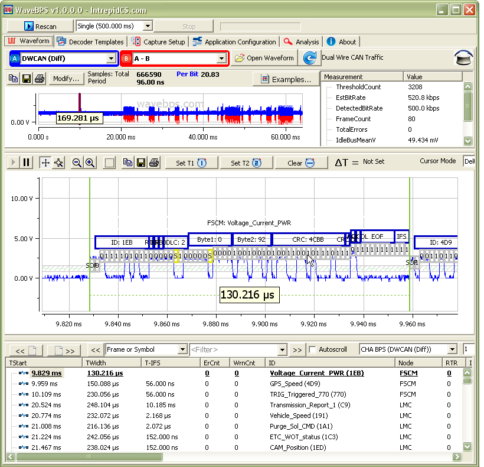
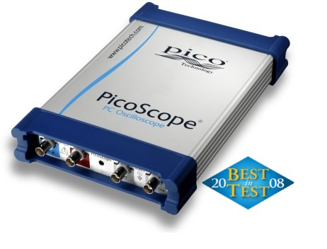

# Introducing WaveBPS: Portable Low level analog serial data analysis

Often in the real world things go wrong to the point where protocol tools do not show enough information - you have to understand what is going on at a lower level.

Intrepid Control Systems, Inc. is proud to introduce WaveBPS - an advanced tool for capturing and analyzing digital protocolanalog waveforms like [SPI](other-buses/spi-bus.md), [I2C](other-buses/i2c-or-smbus.md), [CAN / CAN FD Bus](can-can-fd-bus/), [UART ](other-buses/uart-k-line-j1708-iso9141-gm-cgi-rs232.md)(RS232, J1708, K-Line, SCI, GM CGI), [J1850](other-buses/j1850.md), [FlexRay ](flexray/)or [LIN Bus](lin-bus/).

Besides general purpose monitoring, WaveBPS can quickly capture infrequent or intermittent protocol violations. For example, you can track down the error frames that may occur intermittently. Another application is verifying there are no timing violations on software based protocol implementations.

The trial version of the software is available for [download](https://intrepidcs.com/support/contact-support/) and is useable for training and learning these protocols. The standard and professional versions of WaveBPS are available for [purchase](licensing-wavebps.md).

<figure><figcaption></figcaption></figure>

<table data-view="cards"><thead><tr><th></th><th></th><th data-hidden></th><th data-hidden></th><th data-hidden data-type="files"></th><th data-hidden data-card-target data-type="content-ref"></th><th data-hidden data-card-cover data-type="files"></th></tr></thead><tbody><tr><td><strong>FlexRay Waveforms</strong></td><td>These are 10Mbit FlexRay static slot frames</td><td></td><td></td><td></td><td><a href="example-waveforms/flexray-frame-decode.md">flexray-frame-decode.md</a></td><td></td></tr><tr><td><strong>CAN / CAN FD</strong> <strong>bus Waveform</strong></td><td>This is a 500Kbit DW CAN Bus standard frame</td><td></td><td></td><td></td><td><a href="example-waveforms/can-can-fd-bus-waveform-decoding.md">can-can-fd-bus-waveform-decoding.md</a></td><td></td></tr><tr><td><strong>LIN bus Waveform</strong></td><td>These are 10.41 Kbit LIN Bus frames</td><td></td><td></td><td></td><td><a href="example-waveforms/lin-bus-decode.md">lin-bus-decode.md</a></td><td></td></tr><tr><td><strong>Overview Video</strong></td><td></td><td></td><td></td><td></td><td><a href="https://youtu.be/ROJswJmeXnE">https://youtu.be/ROJswJmeXnE</a></td><td><a href=".gitbook/assets/CAN_bus_decode.png">CAN_bus_decode.png</a></td></tr><tr><td><strong>Specifications</strong></td><td></td><td></td><td></td><td></td><td><a href="specifications.md">specifications.md</a></td><td></td></tr><tr><td><strong>Buy Now</strong></td><td></td><td></td><td></td><td></td><td><a href="licensing-wavebps.md">licensing-wavebps.md</a></td><td></td></tr><tr><td><strong>Product Sales Sheet</strong></td><td></td><td></td><td></td><td></td><td><a href="https://cdn.intrepidcs.net/brochures/icsusa/wavebps.pdf">https://cdn.intrepidcs.net/brochures/icsusa/wavebps.pdf</a></td><td></td></tr></tbody></table>

<figure><figcaption></figcaption></figure>

#### USB Oscilloscope Features

[WaveBPS directly captures](live-capture-with-wavebps.md) data directly from a [PicoScope USB Oscilloscope](http://www.picotech.com/oscilloscope-specifications.html). Depending on the model WaveBPS supports up to 4 channels, 1 GS/s sampling and a memory depth of 128 Mega samples. For hardware triggering the scope offers a CAN / CAN FD error trigger, standard scope analog triggering, and CAN / CAN FD, LIN script based triggering with an Intrepid ValueCAN3 or neoVI FIRE. Also, WaveBPS can load waveform files captured from [popular oscilloscopes](getting-data-into-wavebps/).

#### WaveBPS Productivity Features

Usability is one of the best features of WaveBPS. WaveBPS understands the waveforms you are looking at so you can [quickly navigate and find events and errors](navigation.md). Full mouse and keyboard support allows you to quickly find the information you are looking for. [Powerful cursor measurements](cursor-measurements.md) allow you to quickly determine time, voltage and bus utilization.

#### Export Support

After determining the parts of the waveform of interest the user can [export the waveform subset](exporting-waveforms-from-wavebps.md) for other users to view.

#### Serial Data Decode Support

WaveBPS supports serial decode on FlexRay, CAN Bus, UART (J1708, K-Line, SCI, RS232, GM CGI), J1850, SPI, I2C or LIN Bus. [The baud rate, thresholds and other settings for these protocols is completely configurable by the user in case of specialty probes (ie. current or differential)](setting-up-serial-decoding-in-wavebps.md) modify the expected voltage ranges of the waveforms. WaveBPS also supports GMLAN 3110 high speed mode switch for single wire CAN / CAN FD.

#### Test Automation

WaveBPS has a [TCP/IP software API](automated-test-with-wavebps.md) allowing remote control and analysis from other applications. This includes the ability to control WaveBPS with Vehicle Spy scripting.

#### Powerful Analysis

WaveBPS can also perform [statistical node analysis](advanced-analysis.md) where each automatic measurement is grouped by node and exported to a spreadsheet file.
