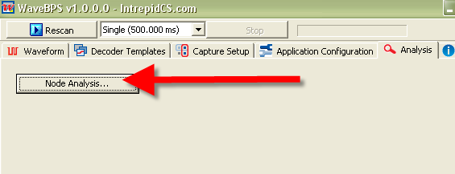

# Advanced Analysis

WaveBPS can do advanced analysis. [When a data base is enabled](/wavebps-basic-databases) you can do statistics on the entire capture according to node (Figure 1). WaveBPS will calculate the min, max, mean for every automatic measurement organized by node. An example node analysis performed on the "dwcan diff traffic" example waveform is [included here](./assets/NodeAnalysis.png) . This type of analysis quickly helps you find nodes that are acting badly.

import YouTubeEmbed from '@site/src/components/YouTubeEmbed';

<YouTubeEmbed videoId="7rItm_F8rj0" caption="Node Analysis Video" />

<figure>

<figcaption>Figure 1- Node analysis will create a statistic report of all automatic measurements organized by node.</figcaption>
</figure>

