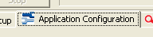
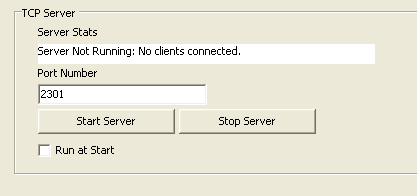

# Automated Test with WaveBPS

WaveBPS includes a TCP/IP server to allow remote control from other applications. The TCP/IP Server offers a text based command set allowing a remote application capture data, save data and collect results. This server is very easily controlled by [Vehicle Spy](https://intrepidcs.com/products/software/vehicle-spy/) scripts allowing test systems that involve both message simulation and diagnostics to be combined with analog capture and analysis.

import image43 from './assets/image-43.png';
import YouTubeEmbed from '@site/src/components/YouTubeEmbed';

The TCP/IP server configuration is available from the 
tab. Here you can enable the TCP/IP server with a specific port. You can also enable the TCP/IP server to start when WaveBPS starts. Make sure to allow the WaveBPS and port you choose access though your firewall.

<!-- 
 -->

<YouTubeEmbed videoId="RkqZbZLd4EM" caption="TextAPIDemo" />

<figure>

<figcaption>Figure 1 - The configuration of the TCP/IP server in WaveBPS.</figcaption>
</figure>

A list of available commands supported is listed in the table 1 below.

**Table 1 - Text API commands for WaveBPS Main Object**

| Command                                  | Description                                                                       | example                                                                                                             |
|------------------------------------------|-----------------------------------------------------------------------------------|---------------------------------------------------------------------------------------------------------------------|
| de                                       | accesses the decoder objects collection                                           | de.count? // returns count of decodersde(0).description SPIDecode // sets description of first decoder to SPIDecode |
| sc                                       | accesses the scope object                                                         |                                                                                                                     |
| an                                       | accesses the analysis results collection (one per channel)                        |                                                                                                                     |
| start                                    | starts wavebps                                                                    |                                                                                                                     |
| stop                                     | stops wavebps                                                                     |                                                                                                                     |
| refreshgui                               | loads the settings into the gui (call when you load configuration settings)       |                                                                                                                     |
| saveentirerawwaveform "filepath"         | saves the current waveform to the "filepath"                                      |                                                                                                                     |
| hascaptureddata?                         | returns whether wavebps has finished captured data                                |                                                                                                                     |
| loadconfig "filepath"                    | loads a configuration indicated by "filepath"                                     |                                                                                                                     |
| an(key or index).getscalar? "scalarname" | reads a scalar value such as error count or frame count                           |                                                                                                                     |
| savevspybuffer "filepath"                | saves a vehicle spy buffer                                                        | savevspybuffer c:	est.csv                                                                                          |
| saveeventlist "filepath"                 | saves the event list to a file name                                               | saveeventlist c:\test.csv                                                                                           |
| autosave                                 | indicates whether autosave should occur on a filter match capture                 | autosave 1                                                                                                          |
| autorearm                                | indicates whether a filter match capture should rearm                             | autorearm 0                                                                                                         |
| autosavepath                             | sets/returns the autosave path                                                    | autosavepath?                                                                                                       |
| decodercha                               | sets/return the index of the decoder for channel a                                | decodercha 1                                                                                                        |
| decoderchb                               | sets/return the index of the decoder for channel b                                |                                                                                                                     |
| decoderchc                               | sets/return the index of the decoder for channel c                                |                                                                                                                     |
| decoderchd                               | sets/return the index of the decoder for channel d                                |                                                                                                                     |
| defaultevent                             | This is the event filter box as an index                                          |                                                                                                                     |
| defaulteventfilter                       | This is the text filter                                                           |                                                                                                                     |
| wavefileplayonmatch                      | returns/sets whether a wavefile should be played when a trigger is matched        |                                                                                                                     |
| wavefilepath                             | returns/sets the path of the of the wavefile that is played when a trigger occurs |                                                                                                                     |

**Table 2 - Decoder Object Properties**

| Command                   | Description                                                                                                                                                                                                        | example |
|---------------------------|--------------------------------------------------------------------------------------------------------------------------------------------------------------------------------------------------------------------|---------|
| baudrate                  | returns/sets the baudrate of the  decoder                                                                                                                                                                          |         |
| basicdatabasepath         | returns/sets the path of the data base for this network                                                                                                                                                            |         |
| canbittolerance           | returns/sets the CAN / CAN FD bit tolerance in percent                                                                                                                                                             |         |
| description               | returns/sets the description of the decoder                                                                                                                                                                        |         |
| decodertype               | returns/set the decoder type. The following values are validDWCAN = 0,FlexRay = 1,SWCAN= 2,LSFTCAN= 3,LIN= 4,J1850VPW= 5,KLine= 7,UART= 9,NoDecode= 10,Disabled=12,MathAMinusB= 13,MathAPlusB= 14,I2C= 15,SPI= 16, |         |
| databitordering           | indicates either endianess of the data items either msb first or last                                                                                                                                              |         |
| datalengthbits            | indicates the number of bits per data item (works for those decoders who support it such as UART and SPI)                                                                                                          |         |
| enablemovingaveragefilter | enables a 3 point moving average for the detecting thresholds                                                                                                                                                      |         |
| errordecodelimit          | returns/set the number errors before the decoder gives up                                                                                                                                                          |         |
| enablegmlancanswitch      | enables message decoding and detection of the GM3110 high speed programming protocol (Automatically switches decoder baud rate)                                                                                    |         |
| enableautobaudrate        | enables an automatic baud rate detection where the estimated baud rate is compared to standard values                                                                                                              |         |
| enablemanualthreshold     | enables a manual threshold as opposed to the automatic algorithim                                                                                                                                                  |         |
| flexraychannel            | inidcates if the flexray monitored is (A or B or auto). this is required for CRC calculation testing because flexray uses different CRCs on channel a and b.                                                       |         |
| highbaudrate              | for swcan indicates the high baud rate that is used when switched                                                                                                                                                  |         |
| highvoltagethreshold      | for swcan is the voltage threshold used to detect transceivers operating in high voltage mode                                                                                                                      |         |
| isinverted                | indicates if the manual threshold detection is inverted                                                                                                                                                            |         |
| idlebitcount              | the number of quiet bit times either between messages or before decoding can start                                                                                                                                 |         |
| idlengthbits              | for protocols that support it - this indicates the length of the ID in bits. the id is shown in the ID column and is used for database searching                                                                   |         |
| rearma                    | this is the voltage threshold for rearm of high voltage                                                                                                                                                            |         |
| rearmb                    | this is the voltage threshold for rearm of low voltage                                                                                                                                                             |         |
| spimode                   | the SPI mode indicates clock polarity and sampling position                                                                                                                                                        |         |
| thresholdhigh             | this the threshold for trigger when the waveform is rising                                                                                                                                                         |         |
| thresholdlow              | this is the threshold for trigger when waveform is falling                                                                                                                                                         |         |
| uartstopbitcount          | this is the count of stop bits for a uart decoder                                                                                                                                                                  |         |
| uartparity                | this is the parity for for a uart decoder                                                                                                                                                                          |         |

**Table 3 - Scope Object Properties**

| capturetype                     | What channels should be collected                                                    |
| ------------------------------- | ------------------------------------------------------------------------------------ |
| couplinga                       | the type of coupling used on channel a                                               |
| couplingb                       | the type of coupling used on channel b                                               |
| couplingc                       | the type of coupling used on channel c                                               |
| couplingd                       | the type of coupling used on channel d                                               |
| capturelengthsamples            | the length of the capture in samples                                                 |
| capturerepeatmode               | the type of capture mode : single, multiple, and filter match                        |
| probeafactor                    | the mulitply factor of the probe used for cha                                        |
| probebfactor                    | the mulitply factor of the probe used for chb                                        |
| probecfactor                    | the mulitply factor of the probe used for chc                                        |
| probedfactor                    | the mulitply factor of the probe used for chd                                        |
| sampleratemicrosecondspersample | the requested sample rate in microseconds per sample                                 |
| specialtriggerbitrate           | the rate used for the can error frame trigger                                        |
| sampleratefrequencyspec         | indicates how the gui displays the sample rate                                       |
| triggersource                   | indicates the trigger source (0 - none, 1 - cha, 2 - chb, 3 - ext, 4 - chc, 5 - chd) |
| triggervoltage                  | the absolute trigger voltage                                                         |
| triggerdirection                | sets the direction rising or falling                                                 |
| triggerhystersis                | hystersis in voltage                                                                 |
| triggerpercentage               | sets the trigger point in precentage (pretrigger)                                    |
| triggertimeoutms                | the time out if the trigger does not occur                                           |
| triggerspecialtype              | sets a special trigger mechanism                                                     |
| voltagerangea                   | sets the voltage range for channel a                                                 |
| voltagerangeb                   | sets the voltage range for channel b                                                 |
| voltagerangec                   | sets the voltage range for channel c                                                 |
| voltageranged                   | sets the voltage range for channel d                                                 | 

**Table 4 - Analysis Object Properties**

|           |                                              |                             |
|-----------|----------------------------------------------|-----------------------------|
| getscalar | returns one of the scalar properties by name | an(0).getscalar? framecount |
