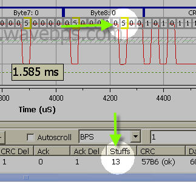

# CAN / CAN FD Bus Bit Stuffing

The CAN / CAN FD waveform is a series of bits. Since there is no clock shared between the CAN / CAN FD bus nodes there must be a way for all nodes to get the clock from the waveform. Therefore receivers use transitions in the CAN / CAN FD waveform to synchronize the receiver clocks to the transmitter.

To ensure there are enough transitions the CAN / CAN FD bus implements bit stuffing. Bit stuffing places a extra opposite bit of the current bit after 5 consecutive identical bits. Since the appearance of stuff bits depends on message content the length of CAN / CAN FD frame will vary depending on the data in it. These extra stuff bits are automatically thown away by the receiver so the application software in the CAN / CAN FD node never sees them.

<figure>

<figcaption>The stuff bits, highlighted in yellow, add overhead to a CAN / CAN FD Message. This message has 13 extra stuff bits.</figcaption>
</figure>

