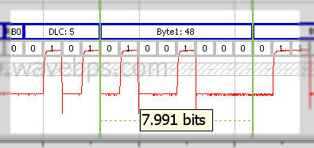

# CAN / CAN FD Bus Data Frame

The CAN / CAN FD bus data frame does the work on CAN / CAN FD. The whole point of CAN / CAN FD is to send data between networked controllers - and that is the job of the data frame.

The data frame begins with a single SOF (start of frame) bit and is followed by the CAN / CAN FD Identifier. The CAN / CAN FD Identifier is used to identify the message and the node the message is coming from. The identifier can be either 11 bits long or 29 bits long depending on the state of some reserved bits.

<figure>

<figcaption>The CAN / CAN FD Data Frame Starts with a SOF bit and then ID bits.</figcaption>
</figure>

After the CAN / CAN FD Identifier, there is a data section that first begins with a data length. The CAN / CAN FD data frame can have 0 to 8 bytes so it uses 4 bits to encode length. The data bytes directly follow the data length.

<figure>

<figcaption>The data bytes follow the data length (DLC) in the CAN / CAN FD Frame.</figcaption>
</figure>

Following the data is the [CRC](https://en.wikipedia.org/wiki/Cyclic_redundancy_check). The CRC is a calculation that is made on the first part of the CAN / CAN FD frame by both the receiver and transmitter. If they match the receiver assumes that it received the data correctly.

<figure>

<figcaption>The CAN / CAN FD CRC checks data integrity while the ack indicates reception by another node.</figcaption>
</figure>

Following the CRC is the Ack field. This field will be set by all other nodes on the network who properly received the frame.

After the Ack bit there will be a quiet time called end of frame space followed by a minimum inter-frame space.

[**Picture of a CAN / CAN FD** **data frame**](/example-waveforms/can-can-fd-bus-waveform-decoding)