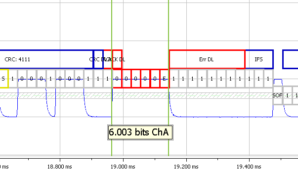

# CAN / CAN FD Bus Errors

The CAN / CAN FD protocol automatically handles protocol errors in hardware - this is what makes CAN / CAN FD robust. If a CAN / CAN FD node receives a message with an error it can destroy the message and cause the transmitter to resend. The CAN / CAN FD node destroys the message by sending an error frame (see the picture below).

CAN / CAN FD bus nodes can detect errors in different ways. For example, a CRC checksum error occurs when the receiver calculates a checksum different than what it received. This means the receiver didn't receive what the transmitter sent. When the CRC error happens a receiver generates an error frame and this causes the transmitter to retransmit the message.

The error frame is six to twelve dominate bits (zeros) and directly violates the [bit stuffing](../can-can-fd-bus-bit-stuffing) rules of CAN / CAN FD. After the dominant bits and passive eight bit delimiter is sent followed by and inter frame separation time (IFS).

The CAN / CAN FD node keeps track of how many times it received or transmitted error frames using error counters. When these error counters reach certain limits the CAN / CAN FD node is first partially disabled (error passive mode) and then totally disabled (bus off mode). This avoids the possibility that a broken node disabling the bus by constantly generating error frames. There are specific rules about how these error counters are incremented or decremented - please consult the CAN / CAN FD spec for details.

<figure>

<figcaption>When an error occurs on the CAN / CAN FD bus an error frame is generated. This is a frame with 6 or more dominant bits followed by a idle bus delimiter. <a href="/img/CAN_error_frame_large.png" target="_blank">See a bigger picture</a></figcaption>
</figure>

<!-- <figure><figcaption>
When an error occurs on the CAN / CAN FD bus an error frame is generated. This is a frame with 6 or more dominant bits followed by a idle bus delimiter. <a href="https://791501338-files.gitbook.io/~/files/v0/b/gitbook-x-prod.appspot.com/o/spaces%2FZRYtbPKu55JGqk9BcS9C%2Fuploads%2FJMVoR5ziKbOCJ4McBw7N%2FCAN_error_frame_large.png?alt=media&#x26;token=cb7bf856-e7d5-4e91-b3d7-9114336ca16e">See a bigger picture</a>.
</figcaption></figure> -->