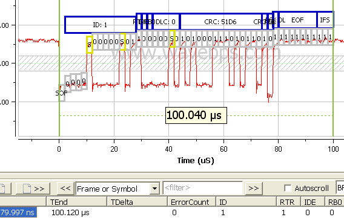

# CAN / CAN FD Bus Remote Data Frame

CAN / CAN FD bus remote frames are optional frames used to request data. Remote frames contain no data section even though the data length code can be greater than zero. You can determine if a frame is a remote frame from the state of the RTR bit (RTR=1). Remote frames are typically not used in automotive applications.

<figure>

<figcaption>Here a remote frame is shown on a CAN / CAN FD L waveform</figcaption>
</figure>

