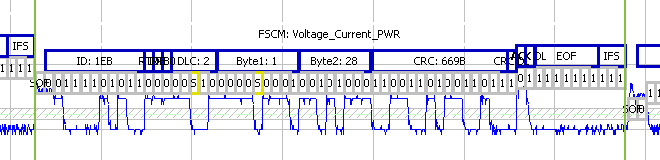

# CAN / CAN FD Bus

CAN / CAN FD Bus is the dominant protocol for networking electronics in vehicles. It features a bit rate up to 1 Mbit and offers simple networking of microcontrollers with the help of dedicated CAN / CAN FD bus silicon called a CAN / CAN FD Controller.

The data transfer message of CAN / CAN FD is the [data frame](./can-can-fd-bus-data-frame). This data frame is allowed to have a longer ID and is then called an [extended data frame](./extended-data-frames).

Used in some applications but not in automotive is the [remote frame](./can-can-fd-bus-remote-data-frame). The remote frame allows a node to request a particular CAN / CAN FD ID.

CAN / CAN FD is very robust. This means it can not only [detect many errors](./can-can-fd-bus-errors) but can take action such as automatic transmission or node shut down.

CAN / CAN FD uses the bit stream to resyncronize the receivers to the transmitter. In order for this to work with specific bit sequences CAN / CAN FD must use [bit stuffing](./can-can-fd-bus-bit-stuffing). Bit stuffing makes decoding a CAN / CAN FD waveform on a traditional oscilloscope difficult.

CAN / CAN FD is a data link layer. To signal CAN / CAN FD electrically there are three [common physical layers](./can-can-fd-bus-physical-layers) in use.

In some applications where [CAN / CAN FD is used FlexRay or LIN](../compare-flexray-can-can-fd-bus-and-lin-bus) may provide advantages.

The CAN / CAN FD bus Specification from Bosch: [can2spec.pdf](/downloads/can2spec.pdf)

<figure>

<figcaption>A CAN / CAN FD Bus Data Frame.</figcaption>
</figure>

