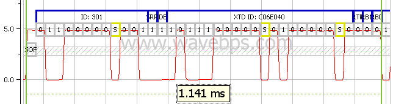

# Extended Data Frames

Extended identifier CAN / CAN FD Frames use 29 bits for identification purposes instead of 11 for the [standard can frame](../can-can-fd-bus-data-frame). Because this extra ID space adds 20 bits of overhead (18 ID and 2 reserved) it is usually not used by networks which want the highest performance.

In the J1939 and GMLAN protocols, the larger ID is segmented into different parts with each part having meaning. For example the least significant 8 ID bits for both J1939 and GMLAN indicate a node's source address.

<figure>

<figcaption>This [Single Wire CAN / CAN FD](../single-wire-can-can-fd) extended ID is 29 bits long (not counting the [stuff bits](../can-can-fd-bus-bit-stuffing)). Many system designers do not use this ID length because of all the overhead it requres.</figcaption>
</figure>

