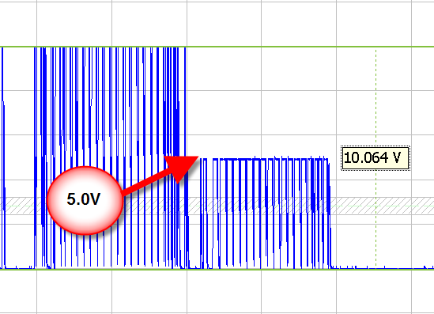

# Single Wire CAN / CAN FD

Single wire CAN / CAN FD is a physical layer that was created by General Motors. It allows CAN / CAN FD communication using a single wire at low bit rates such as 33.3 Kbps. It allows a high speed mode for flash programming. Finally, while most can transceivers offer only a 1 or 0, single wire can offers a third state called high voltage mode. This mode enables selectable power management of CAN / CAN FD nodes.

<figure>

<figcaption>This shows two different Single Wire CAN / CAN FD frames. One transmitted in high voltage mode and the other the normal voltage.</figcaption>
</figure>

