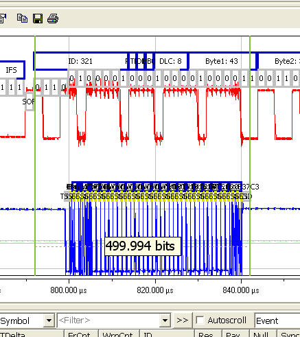
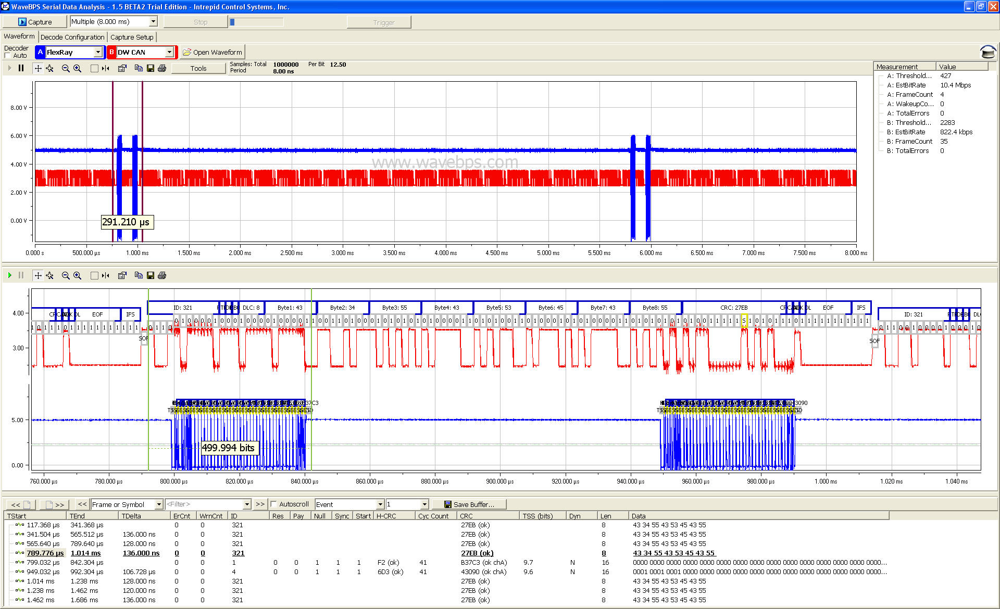

# Compare FlexRay, CAN / CAN FD bus and LIN Bus

FlexRay, CAN / CAN FD Bus, and LIN bus are very different protocols and fit very different applications. Therefore, it is very unlikely that any of these protocols will replace the other. For example, the FlexRay protocol was designed for specific time deterministic applications with fault tolerance and may replace CAN / CAN FD in applications such as safety, chassis, and powertrain but not in body or diagnostics.

<figure>

<figcaption>FlexRay is faster than the CAN / CAN FD bus. Here we can see a 32 byte FlexRay 10 MBit frame taking just a fraction of a 500Kbits CAN / CAN FD frame.</figcaption>
</figure>

**Full Image**

<figure>

<figcaption></figcaption>
</figure>

