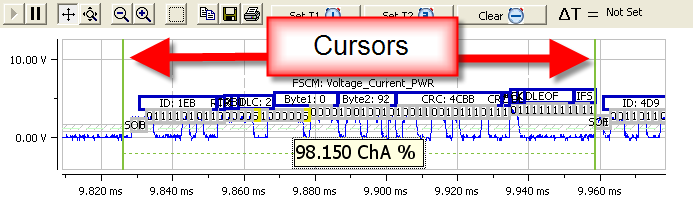
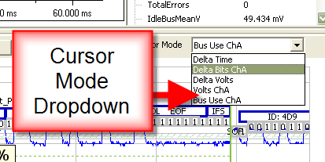
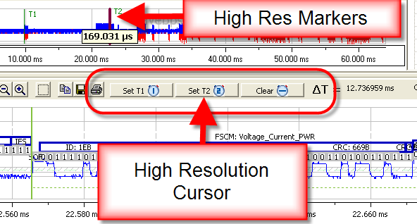

# Cursor Measurements

WaveBPS - has powerful cursors which allow you to do measurements. Cursors allow you to make time, voltage, time in bits, and bus utilization measurements (figure 1). The normal cursor appears in the zoomed view. A high resolution time measurement cursor is also available for measuring time across a large waveform.

import YouTubeEmbed from '@site/src/components/YouTubeEmbed';

<YouTubeEmbed videoId="4phpFE8MoKE" caption="Cursor Measurement Video" />

<figure>

<figcaption>Figure 1 - The Cursors allow you to make time, voltage, and bus use measurements</figcaption>
</figure>

You can change what the cursors measure by double clicking the tool tip or by using the cursor mode drop down (Figure 2).

<figure>

<figcaption>Figure 2 - You can change the measurement mode of the cursor using this drop down</figcaption>
</figure>

The high resolution cursor allows you to make time measurements across the entire waveform capture. First, position the left cursor on the first time and click the "Set T1" button. Next, position the right hand cursor on the second time and click "Set T2". After this the high resolution time delta will be displayed to the right of the high resolution cursor buttons. Both T1 and T2 times will be displayed in the entire waveform view.

<figure>

<figcaption>Figure 3 - The high resolution cursor can make accurate timing measurements.</figcaption>
</figure>

