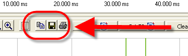
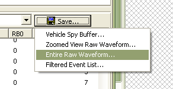
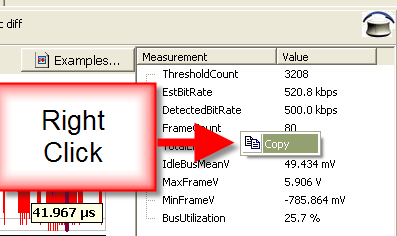
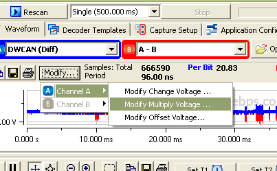

# Exporting Waveforms from WaveBPS

WaveBPS allows you to export data many ways. This includes exporting the event list, the entire raw waveform, subsets of the waveform, picture files of the waveform, and log files compatible with Vehicle Spy software. You can also copy the event list or scalar list to the clipboard for transfer to other applications.

<figure>

<figcaption>Figure 1 - WaveBPS can export pictures very simply.</figcaption>
</figure>

import YouTubeEmbed from '@site/src/components/YouTubeEmbed';

<YouTubeEmbed videoId="Sa-WZTvxGEM" caption="Exporting Data Video" />

Clicking on the save button shows a drop down allowing you to export the waveform many different ways (figure 2). First, the Vehicle Spy buffer exports a waveform that is compatible with the [Vehicle Spy software](https://intrepidcs.com/products/software/vehicle-spy/). Next you can export the raw waveform as either the zoom view (a subset) or the entire view. Finally, you can also export the event list.

If you export the raw waveform you can save either a wbps file or a wbpx file. The wbps is a binary file which you can later open with WaveBPS . The file format is open and is [described in this topic](/wbps-binary-file-format). The wbpx file is special output file that allows you to open the waveform with the trial version of WaveBPS. The wbpx file output is great for sharing waveforms.

Another option for raw waveform export is CSV. The CSV file format is the most portable format but it is very inefficient. So storing a 128 MSample waveform will take a huge amount of space. The CSV is only recommended for smaller waveforms or subset waveforms.

If you select "Filtered event list" you will save the event list. It will not save the entire list though if you have a filter. If you have a filter only the items that match the filter will be saved.

<figure>

<figcaption>Figure 2 - WaveBPS offers different ways to export data.</figcaption>
</figure>

You can quickly copy the scalar list or the event list by right clicking and selecting copy (figure 3).

<figure>

<figcaption>Figure 3 - WaveBPS can copy the scalars to the clipboard.</figcaption>
</figure>

You can also modify the waveforms before you export them (figure 4). This allows you to create waveforms with disturbances that you may then load into an arbitrary waveform generator.

<figure>

<figcaption>Figure 4 - WaveBPS can export waveforms and modify them to create errors.</figcaption>
</figure>

