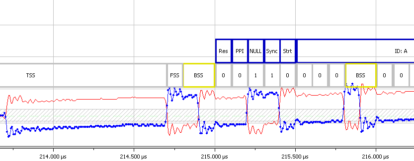

# FlexRay Physical Layer

The FlexRay physical layer uses differential signaling to communicate flexray frames. Unlike CAN / CAN FD and LIN the FlexRay physical layer does not allow multiple nodes to drive the bus simultaneously. Also, in FlexRay, the bus voltages are different for a 0, 1, and idle bus.

<figure>

<figcaption>The FlexRay Physical Layer uses a differental waveform to signal data.</figcaption>
</figure>

