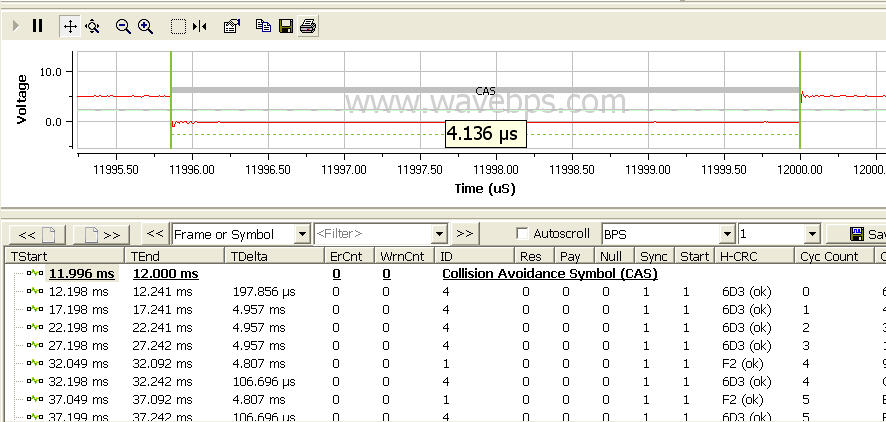

# FlexRay Startup

The FlexRay startup process involves getting all the nodes from not communicating to communicating. This involves specific nodes, called cold start nodes, to begin the communication in a specific way to get the network time synchronized. After this procedure the normal FlexRay communication begins.

When a node determines that both FlexRay channels have [woken up](../flexray-wakeup-symbol), the leading cold start node will issue the Collision Avoidance Symbol (CAS) as shown below. Also shown below, the leading cold start node will begin its communication cycle starting with cycle 0. After enough cycles occur the other cold start nodes will time synchronize to the leading cold start node and begin their communication cycles. After the cold start nodes other non cold start nodes join and the normal FlexRay cycle begins.

<figure>

<figcaption>Here a FlexRay startup is shown with a Leading cold start node generating the CAS and first few cycles with the second node joining the network on cycle 4.</figcaption>
</figure>

