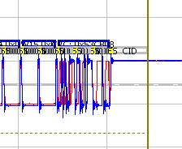

# FlexRay Static Frame

In FlexRay there are two possible ways to transmit data, static frames and [dynamic frames](../flexray-dynamic-frame). The frames are nearly identical in shape. The difference is when they are allowed to be transmitted. During network design the static frame is engineered to be sent always at specific times. This "static" behavior gives the network time deterministic features. For example, the network designers can ensure a particular variable is always updated exactly every 2 milliseconds.

#### [Picture of some static frames](/example-waveforms/flexray-frame-decode)

<figure>

<figcaption>The above picture is the two CRCs overlaid of an identical frame sent on both A and B FlexRay Channels. Notice the CRCs are different.</figcaption>
</figure>

