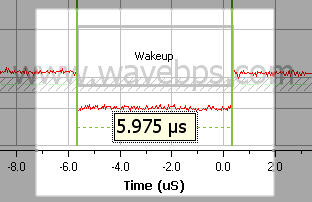
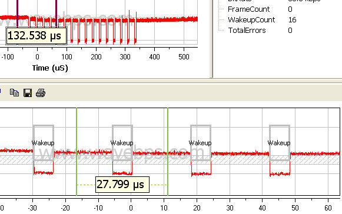
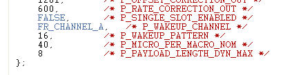

# FlexRay Wakeup Symbol

FlexRay supports power management wakeup using the wakeup symbol. This wakeup symbol is repeated a fixed number of times. The wakeup symbol only pulls the bus in one direction and this avoids a possible contention that could occur if another node sent the pattern at the same time.

<figure>

<figcaption>The wakeup pulse is only one direction which allows possible collisions</figcaption>
</figure>

<figure>

<figcaption>The wakeup symbol is repeated a number of times as part of the FlexRay cluster configuration</figcaption>
</figure>

<figure>

<figcaption>Here the number of wakeup symbols is part of the FlexRay cluster configuration</figcaption>
</figure>

