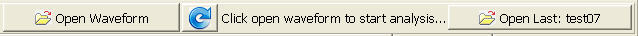
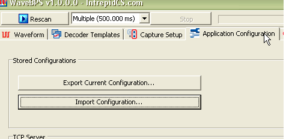

# Getting Data into WaveBPS

Besides capturing [live data from a USB oscilliscope,](/live-capture-with-wavebps) you can load data into **WaveBPS** from a saved data file. First you pick a decoder and click "Open Waveform" (figure 1). After doing this the waveform will be plotted and decoded. The zoomed waveform view will then show the first event in the data.

import YouTubeEmbed from '@site/src/components/YouTubeEmbed';

<YouTubeEmbed videoId="meTjOEeCTEE" caption="Importing Data Video" />

You can also click the refresh button to decode the current waveform again. This maybe useful if you want to update the view with a new decoding or thresholds. Finally when you start again a button will appear allowing you to open the last waveform file you looked at.

<figure>

<figcaption>Figure 1 - you can open waveforms from a file by clicking "Open Waveform</figcaption>
</figure>

**WaveBPS** supports waveforms from Lecroy and Picoscope oscilloscopes. [Also you can write a simple import plug-in using Visual C++](/loading-custom-data-into-wavebps) using the sample project provided. Please [contact us](http://www.intrepidcs.com) to write an import for your capture device.

WaveBPS automatically stores your current setup when you close the application. This setup resides in a file called "wavebps defaults.xml" stored in the applications directory. You can save or load a previous setup at anytime by clicking the application configuration tab and selecting import or export configuration. You can also load these remotely using the [Text API](/automated-test-with-wavebps).

<figure>

<figcaption>Figure 2 - you can import and export the current wavebps configuration.</figcaption>
</figure>

