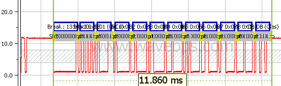

# LIN Bus

LIN Bus is a low speed network that focuses on ulta low cost low speed (5-20 Kbits) applications. It is UART based and provides time deterministic messaging via [LIN Frames](./lin-frame).

<figure>

<figcaption>The UART based LIN Frame is consists of a break, break sync, ID, Data bytes and checksum.</figcaption>
</figure>

The LIN Bus uses a master node to control all communications. Unlike any other protocol, the LIN protocol frame can be composed of data from two separate nodes. The LIN master node supplies the [first half of the message](./lin-header) consisting of the Break, Sync field and ID. The [rest of the frame](./lin-slave-section) is filled in by either the master node or slave node depending on the ID.

There are different [errors that can occur on a LIN bus](./lin-errors) including problems with break, sync field, checksum, timing and the unresponsive nodes.

[LIN's advantage over CAN / CAN FD and FlexRay](../compare-flexray-can-can-fd-bus-and-lin-bus) is primarily cost. Time determinism is also a major advantage over CAN / CAN FD bus. LIN's relative slowness is the primary disadvantage.

#### [Visit the LIN Consortium Website](http://www.lin-subbus.org/)