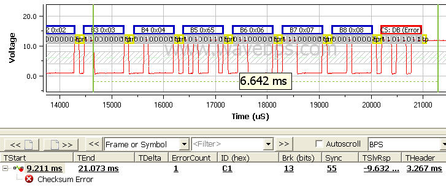

# LIN Errors

There are many possible errors in the LIN protocol. Some of them include: 1) the frame taking too long, 2) a checksum error, 3) sync problems, and 4) LIN ID parity. Also, unlike CAN / CAN FD and FlexRay, the LIN protocol is almost always written as a software driver. Therefore, application issues, such as disabling interrupts, can cause intermittent timing errors.

<figure>

<figcaption>Here a LIN Checksum error indicates that something is not correct in the data section.</figcaption>
</figure>

