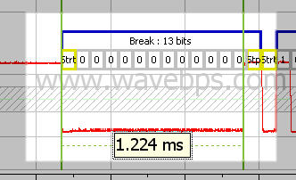
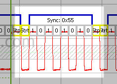
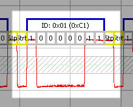

# LIN Header

The LIN Header is the first part of the LIN Message. It begins with a sync break, followed by a sync waveform and then the LIN identifier. After this portion of the message, the ID indicates which node should respond with the [slave part of the message](../lin-slave-section).

The Sync break is a [UART](http://en.wikipedia.org/wiki/UART) break that is low for 13 or more bits. All LIN devices see this symbol as the start of a message as it is a special symbol that forces a UART frame error.

<figure>

<figcaption>Sent by the master node, the LIN Break indicates the start of a LIN Frame</figcaption>
</figure>

After the Sync break is the sync waveform. The sync waveform is always the UART byte 0x55. This byte, as you can see from the the picture below, is an alternating sequence of 1's and 0's. This waveform allows the slave devices to calibrate their UART clock to that of the master. This allows cost savings in slave devices using a time and temperature dependant, but cheap [R-C Oscillator](http://en.wikipedia.org/wiki/RC_oscillator).

<figure>

<figcaption>The sync byte is always hex 0x55 and can be used by slave devices to calibrate their clocks</figcaption>
</figure>

After the Sync byte is the LIN ID. The LIN ID consists of 6 ID bits and 2 [parity bits](http://en.wikipedia.org/wiki/Parity_bit). The parity bits are calculated according to the LIN Specification. Normally, parity bits are pre-calculated for receivers and transmitters. When an ID is referenced including the parity bits it is called the "protected ID" - the normal LIN ID is without the parity bits. For example, the LIN ID shown below is the LIN ID 0x01 with a protected ID of 0xC1.

<figure>

<figcaption>The ID indicates what data needs to sent in the data section and includes parity bits.</figcaption>
</figure>

