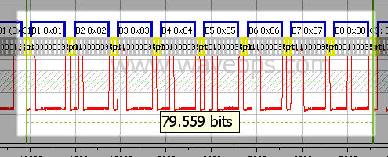
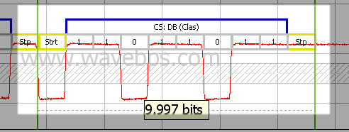

# LIN Slave Section

The LIN Slave section includes the data of the LIN frame followed by the checksum. The slave section follows the [LIN Header](../lin-header) part of the [LIN Frame](../lin-frame).

<figure>

<figcaption>The LIN Data section includes up to 8 data bytes</figcaption>
</figure>

After the data section is the checksum. The checksum will vary based on the LIN specification. LIN supports both a classic and enhanced checksum. The classic checksum uses all the databytes while the enhanced also includes the ID.

<figure>

<figcaption>The LIN Checksum is the last part of the LIN frame.</figcaption>
</figure>

