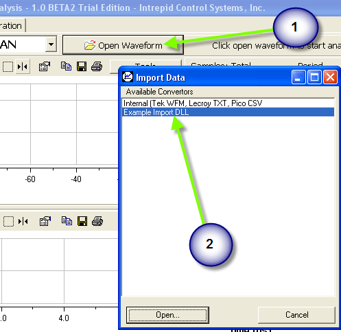
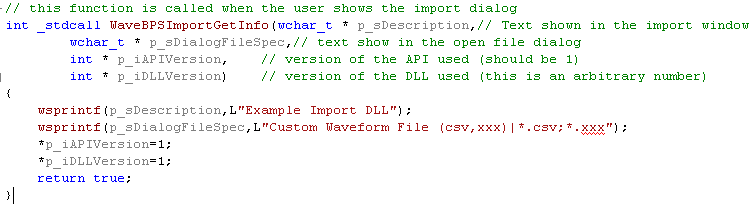
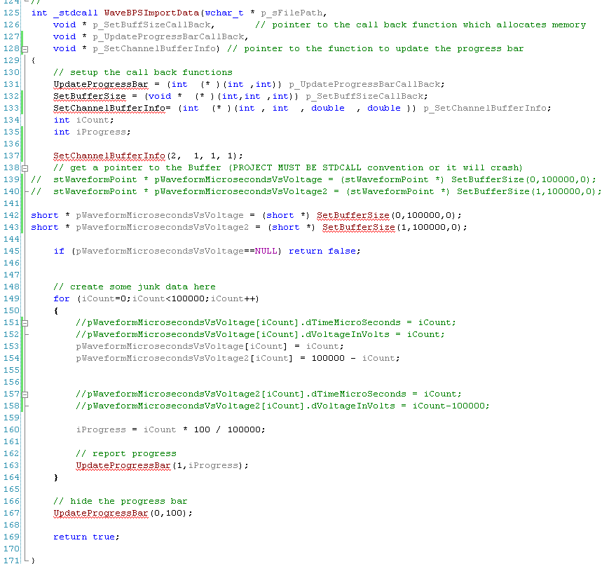
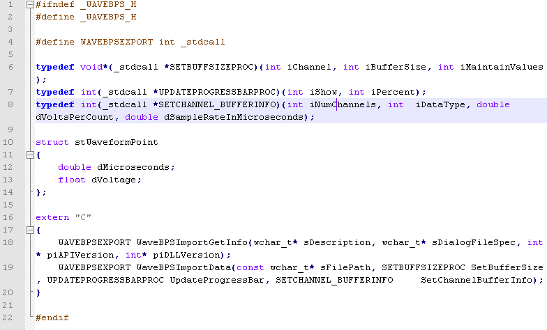

# Loading custom data into WaveBPS

import DownloadFile from '@site/src/components/DownloadFile';

* **Download example project  from the following —**
  
<DownloadFile fileName="wavebpsimport.zip" fileSize="7KB" filePath="/downloads/wavebpsimport.zip" />

<!-- <a href="/downloads/wavebpsimport.zip" class="span-custom-link">wavebpsimport.zip</a> -->
<br/>

WaveBPS - allows you to create your own support for importing data. Users can do this by creating a Windows DLL that implements two functions. One function allows WaveBPS to get information about the DLL. The other API does the import. All functions in the dll must use the \_\_stdcall calling convention.

First, when the user clicks the open waveform (Figure 1 - bubble 1) button WaveBPS will search its install directory (where the exe is at) for an "import" subdirectory . For all the DLLs in the subdirectory it will call the function "WaveBPSImportGetInfo" (Figure 2) to find out what types of files the DLL supports and a description. The description is listed in the box of possible import types (Figure 1 - bubble 2).

<div class="text--center">

<figure>


<figcaption>Figure 1 - Clicking import will show the import data dialog listing the DLLs available for import.</figcaption>
</figure>
</div>

<br/>

<div class="text--center">

<figure>


<figcaption>Figure 2 - The WaveBPSImportGetInfo API allows WaveBPS to determine what types of Files the DLL supports.</figcaption>
</figure>
</div>

If the user selects the import a file open dialog will be shown. If the user then selects a file the second API will be called - WaveBPSImportData. This is shown in figure 3 below. This function receives the FilePath selected by the users and three function pointers. One function pointer indicates the number of channels and buffer type information. Another function pointer is to set the buffer size required by the import data. The other allows the import to update the progress bar in the WaveBPS application.

The first callback sets up the number of channels (currently up to two channels is supported) and the data type. WaveBPS supports two data types. The first is a struct which defines a floating point time and voltage (iDatatype ==0). The second data type (iDatatype ==1) is a short array which has a constant time and voltage scaling (indicated by arguments dVoltsPerCount and dSampleRateInMicroseconds). The short array is more memory efficient for large data sets. dVoltsPerCount and dSampleRateInMicroseconds are ignored for iDataType==0.

Also shown in figure 4, one of the callbacks is to get the memory pointer for the data buffer WaveBPS will use. This API called SetBufferSize takes three arguments and returns the pointer to the buffer. The first argument is the channel number. The next argument is the size of the buffer and the other is a flag to indicate whether the existing buffer data should be preseved with the new buffer. It is recommended to use the preserve as little as possible for performance reasons. If for some reason WaveBPS cannot allocate the memory for the import the SetBufferSize function returns null.

The second call back is for updating the progress bar. There are two arguments - one is the an int indicating whether or not to show the progress bar and the other is the progress value from 0-100.

When datatype ==0, The pointer returned from SetBufferSize is a pointer to stWaveFormPoint structures otherwise its a short array. This includes the waveform values in voltages and times in microseconds. When datatype ==1 it is just a short array.

<div class="text--center">

<figure>


<figcaption>Figure 3 - The API function in the DLL that allows data to be loaded into WaveBPS.</figcaption>
</figure>
</div>

<br/>

<div class="text--center">

<figure>


<figcaption>Figure 4 - The API for loading uses these call back functions and one data strutures for getting data.</figcaption>
</figure>
</div>

<!-- <figure><figcaption><p>Figure 4 - The API for loading uses these call back functions and one data strutures for getting data.</p></figcaption></figure> -->

**DLL DEF file**

`LIBRARY waveimpex.dll`

`EXPORTS`

`WaveBPSImportGetInfo @1 PRIVATE`

`WaveBPSImportData @2 PRIVATE`

**DLL Code Listing**

```c
#include <string>
#include <windows.h>
#include <fstream>
#include <map>
#include "wavebps.h"
#include "CMatlabBlock.h"

using namespace std;

/*
* WaveBPS plugin example.
* This will load .MAT files generated by PicoScope 6
* (c) 2008 Intrepid Control Systems, Inc.
* www.wavebps.com
*/


string ToString(const wstring & sStr)
{
string::size_type size = sStr.length() + 1;
char * temp = new char[size];

WideCharToMultiByte(CP_UTF8, 0, sStr.c_str(), size, temp, size, NULL, NULL);

string ret(temp);
delete [] temp;

return ret;
}

WAVEBPSEXPORT WaveBPSImportGetInfo(wchar_t* sDescription, wchar_t* sDialogFileSpec, int* piAPIVersion, int* piDLLVersion )
{
wsprintfW(sDescription,L"Matlab 4");
wsprintfW(sDialogFileSpec,L"Matlab 4 Files (.mat)|*.mat|");
*piAPIVersion = 1;
*piDLLVersion = 1;
return 1;
}

WAVEBPSEXPORT WaveBPSImportData(const wchar_t* sFilePath, SETBUFFSIZEPROC SetBufferSize, UPDATEPROGRESSBARPROC UpdateProgressBar,SETCHANNEL_BUFFERINFO SetChannelBufferInfo)
{
ifstream matfile( ToString( wstring(sFilePath) ).c_str(), ios_base::in | ios_base::binary );
if( matfile.fail() )
{
MessageBox(NULL,"Error reading in file","matimport",MB_OK);
return 0;
}

map< string, CMatlabBlock > matlabblocks;
UpdateProgressBar(1,0);
matfile.seekg(ios::end);
int filesize = matfile.tellg()*2; //double scale it so reading the file only goes up to 50%
matfile.seekg(ios::beg);
do
{
try
{
CMatlabBlock mblock( matfile );
matlabblocks.insert( pair<string,CMatlabBlock>( mblock.GetName(), mblock ) );
}
catch( CMatlabBlock::ReadFileError& rfe )
{
MessageBox(NULL,"Error reading in file","matimport",MB_OK);
matfile.close();
return 0;
}
catch( CMatlabBlock::GotEOF& eof )
{
continue;
}
catch(...)
{
MessageBox(NULL,"Error reading in file","matimport",MB_OK);
matfile.close();
return 0;
}
UpdateProgressBar(1, ((float)matfile.tellg()/filesize)*100);

} while( !matfile.eof() );
matfile.close();

//find the "A" channel
map< string, CMatlabBlock >::iterator it = matlabblocks.find(string("A"));
if( it == matlabblocks.end() )
{
MessageBox(NULL,"No data channel","matimport",MB_OK);
return 0;
}
CMatlabBlock& datachannel = it->second;

//what kind of timing is in the file? an array that matches up to the data or an offset and interval?
CMatlabBlock* timechannel = NULL;
double timestart, timeinterval;
it = matlabblocks.find(string("T"));
if( it == matlabblocks.end() )
{
//not an array, it's offset type
it = matlabblocks.find(string("Tstart"));
if( it == matlabblocks.end() )
{
MessageBox(NULL,"No timing data!","matimport",MB_OK);
return 0;
}
switch( it->second.GetHeader().DataFormat )
{
case Double:
timestart = *(double*)it->second.GetData();
break;
case Single:
timestart = *(float*)it->second.GetData();
break;
case Integer:
timestart = *(int*)it->second.GetData();
break;
}

it = matlabblocks.find(string("Tinterval"));
if( it == matlabblocks.end() )
{
MessageBox(NULL,"No timing data!","matimport",MB_OK);
return 0;
}
switch( it->second.GetHeader().DataFormat )
{
case Double:
timeinterval = *(double*)it->second.GetData();
break;
case Single:
timeinterval = *(float*)it->second.GetData();
break;
case Integer:
timeinterval = *(int*)it->second.GetData();
break;
}
}
else
timechannel = &it->second;

SetChannelBufferInfo(1,0, 0.0, 0.0);

stWaveformPoint* pPoints = (stWaveformPoint*) SetBufferSize(0, datachannel.GetHeader().NumberOfValues, false );

for( int i = 0 ; i < datachannel.GetHeader().NumberOfValues ; i++ )
{
double time;
float volt;
switch( datachannel.GetHeader().DataFormat )
{
case Double:
volt = ((double*)datachannel.GetData())[i];
break;
case Single:
volt = ((float*)datachannel.GetData())[i];
break;
case Integer:
volt = ((int*)datachannel.GetData())[i];
break;
}
if( timechannel )
{
switch( timechannel->GetHeader().DataFormat )
{
case Double:
volt = ((double*)timechannel->GetData())[i];
break;
case Single:
volt = ((float*)timechannel->GetData())[i];
break;
case Integer:
volt = ((int*)timechannel->GetData())[i];
break;
}
}
else
{
time = timestart + (timeinterval*i);
}

pPoints[i].dMicroseconds = time * 1000000;
pPoints[i].dVoltage = volt;

UpdateProgressBar(1, (((float)i/datachannel.GetHeader().NumberOfValues*2)*100) + 50 );
}

UpdateProgressBar(0,100);

return 1;
}


```