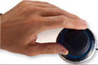
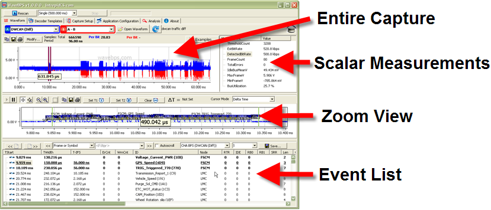
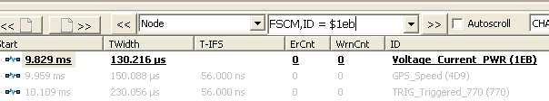
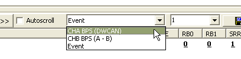
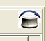
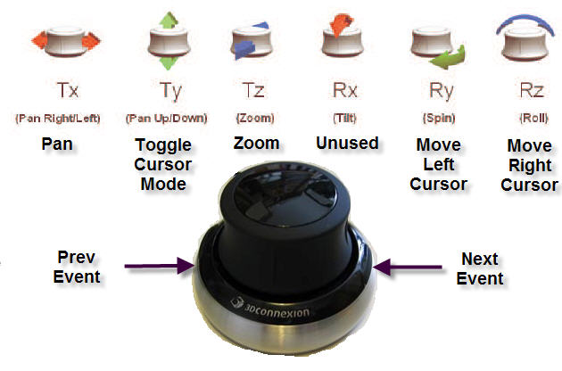

# Navigation

WaveBPS was designed to support very efficient waveform navigation using the mouse and the optional knob (figure 1). This allows you to quickly focus in on the information you are interested in the waveform. This is especially important when searching megasamples of waveform data.

The WaveBPS application has four main parts, the entire capture, scalar measurements, the zoomed view and the event list. The summary waveform shows the entire file while the zoomed waveform shows the region of interest. The scalar measurements list measurements made on the entire capture ([more here](/scalar-measurement-list)). Lastly, the event list, will list all of the events such as Frames or symbols decoded from the entire capture. See the screen shot below.

<figure>

<figcaption>Figure 1 - For customers who miss the knobs of a traditional oscilloscope WaveBPS supports the [Space Navigator](/navigation/#navigation-using-the-space-navigator)</figcaption>
</figure>

import YouTubeEmbed from '@site/src/components/YouTubeEmbed';

<YouTubeEmbed videoId="DnAYCjFp474" caption="Navigation Video" />

<figure>

<figcaption>Figure 2 - The main sections of the WaveBPS GUI</figcaption>
</figure>

### Navigation using the Summary Waveform

To modify the Zoomed waveform to set what you are interested in, you have a number of options. First, you can change the cursors in the summary waveform. This will cause the zoomed waveform to show the area between the cursors. You can also double click an area in the summary waveform to center the cursors.

To modify the Zoomed waveform to set what you are interested in, you have a number of options. First, you can change the cursors in the summary waveform. This will cause the zoomed waveform to show the area between the cursors. You can also double click an area in the summary waveform to center the cursors.

### Navigation using the Event List

Next you can double click an item in the event list. This will pan and zoom the waveform displays to the event described in the list. You can also double click any column on an item and the waveforms will zoom into that automatic measurement. For example, you can double click on the CRC and the zoomed view will show the CRC part of the event. The Columns in the event list are described here in a [seperate topic](/event-list-columns).

As you navigate the zoom view the event list will automatically scroll to the events visible. The events visible in the zoom view will have bold text.

### Navigation using the Browse Toolbar

The browse toolbar is a very powerful way to browse waveforms. Shown below the browse tool bar allows you to quickly page left and right, or browse to the next event. It also supports filtering. This allows you to quickly skip to the next frame, waveform error, or waveform symbol such as CAN / CAN FD bus acknowledge bits. Alt -Left and Alt-Right keys quickly take you to the next event.

Select the item you wish to filter upon in the drop down, then enter a filter specification in the box to the left (figure 3). Table 1 lists the filter specifications possible. For filters that use math you can use a "$" character to represent hex data. You can enter more than one filter spec for multiple columns but you have to do this by adding the comma, the name of the second column, a space and then the second filter specification. This filter is also used in the [filter match capture mode](/live-capture-with-wavebps).

<figure>

<figcaption>Figure 3 - The browse filter can be multi-item to allow searching for events.</figcaption>
</figure>

| Filter Type  | Description                               | Example                                     |
| ------------ | ----------------------------------------- | ------------------------------------------- |
| Text Compare | Basic Text wildcard filter `*`, `?` supported | `7e?`                                   |
| `=`          | equality                                  | `= 1` // hispeed mode is greater than 1     |
| `>`, `>=`    | greater than (or equal to)                | `> 0` // error count greater than 0         |
| `<`, `<=`    | less than (or equal to)                   | `< 10` // TIFS less than 10 microseconds    |
| `{}`         | inside a range of values                  | `{}` `$240-$247` // inside a range          |

### Navigation using Auto scroll

Sit back and watch with Auto scroll (figure 4). Auto scroll will scroll at a user specified bit rate or will skip to the next waveform events at intervals. This allows very quick visual review of a lot of waveform data.

<figure>

<figcaption>Figure 4 - auto scroll waveform based on events or at a bit rate.</figcaption>
</figure>

### Navigation using the zoomed waveform

The zoomed waveform is mouse friendly. You can pan and zoom the X axis in the zoomed waveform using the mouse wheel. Double clicking will center the plot too. Finally pressing the spacebar will take you to the next browse event.

### Navigation using the Space Navigator

The [Space Navigator](https://3dconnexion.com/3dmouse/spacenavigator.php) is a analog six axis USB joystick knob with two buttons. Using this knob you can very quickly zoom in and out, pan and make measurements. When connected WaveBPS will show the knob icon (figure 5). See the figure 6 below for how the knob works with WaveBPS.

<figure>

<figcaption>Figure 5 -WaveBPS will show the knob icon if the knob is connected.</figcaption>
</figure>

<figure>

<figcaption>The knob gives you powerful navigation of the captured waveform.</figcaption>
</figure>

