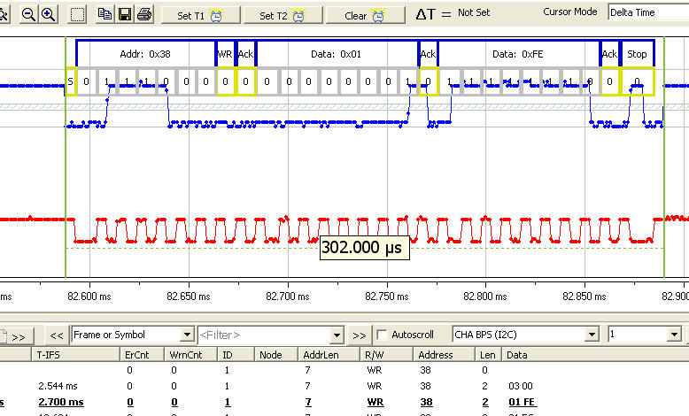
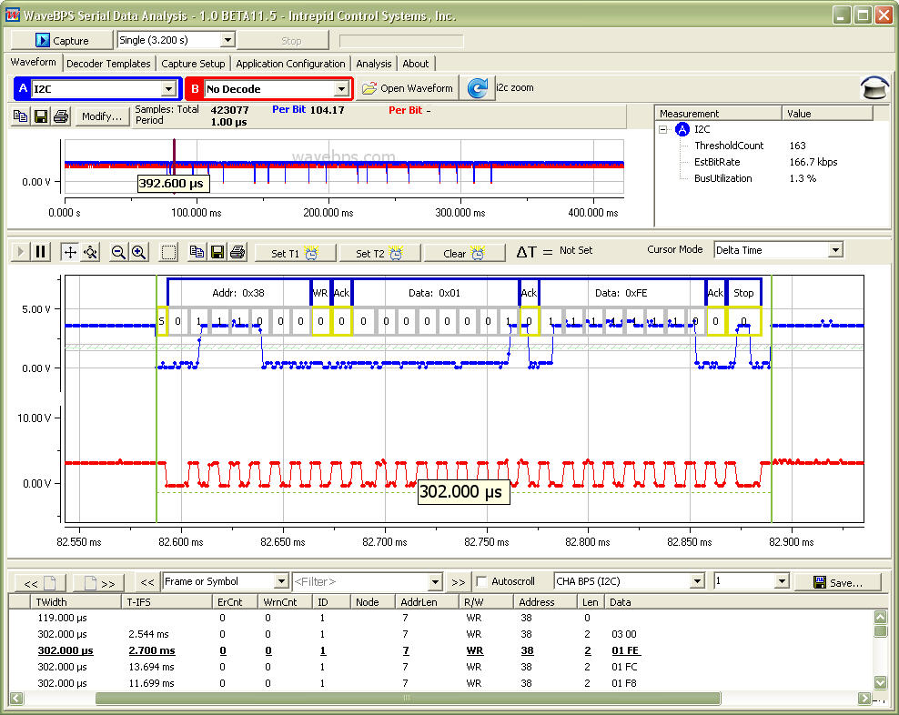

# I2C or SMBus

I2C or SMBus bus is a peripheral interface used for communications between devices in embedded electronics. More at [Wikipedia](https://en.wikipedia.org/wiki/I2C).

<figure>

<figcaption>The I2C Bus uses two lines to communicate bi-directional data.</figcaption>
</figure>

**Full Image**

<figure>

<figcaption></figcaption>
</figure>

