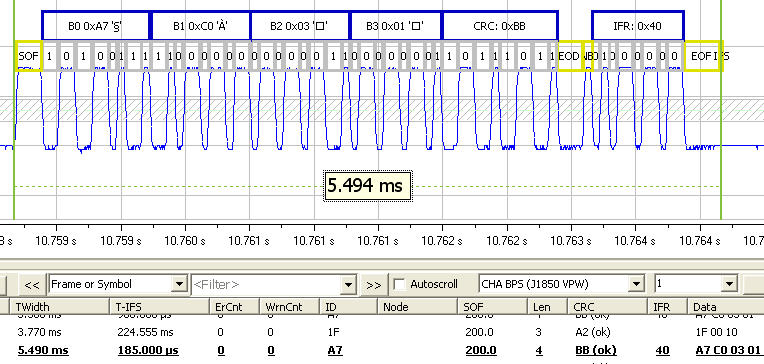
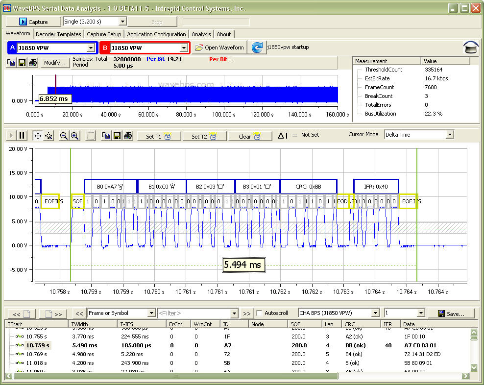

# J1850

J1850 is an older protocol used by North American manufactures for Vehicle networking. More information on J1850 can be found in the SAE J1850 specification from [SAE.org](http://www.sae.org).

<figure>

<figcaption>This J1850 waveform from a Chrysler vehicle supports a 1 byte IFR section.</figcaption>
</figure>

**Full Image**

<figure>

<figcaption></figcaption>
</figure>

