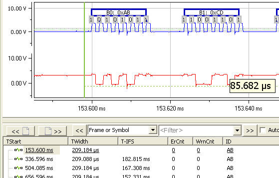
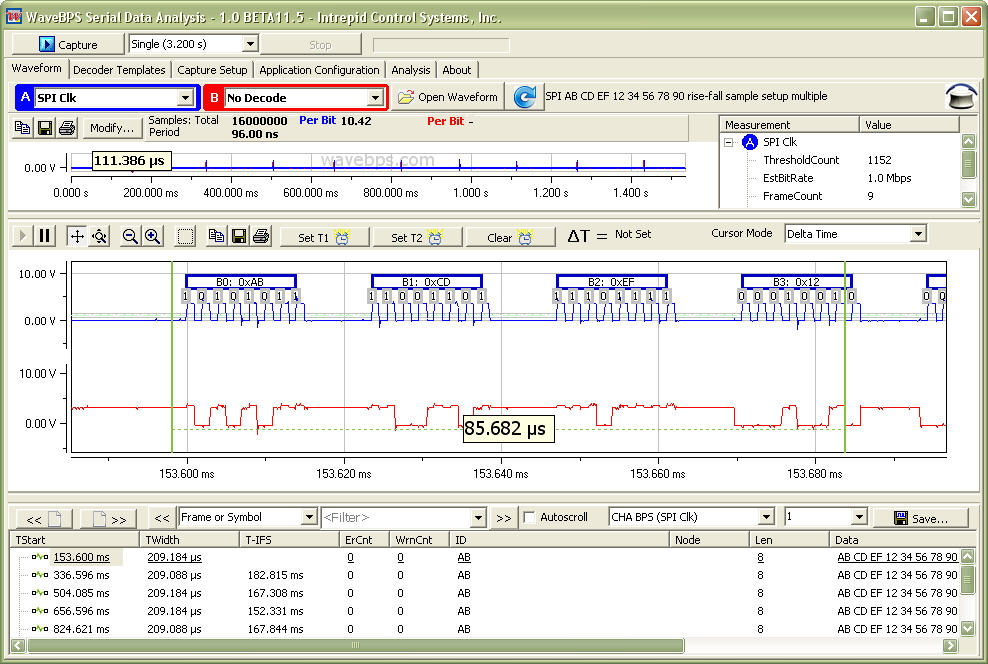

# SPI bus

SPI bus is a peripheral interface used for communications between devices in embedded electronics.. More at [Wikipedia](https://en.wikipedia.org/wiki/Serial_Peripheral_Interface).

<figure>

<figcaption>The SPI Bus is used for embedded device communications</figcaption>
</figure>

**Full Image**

<figure>

<figcaption></figcaption>
</figure>

