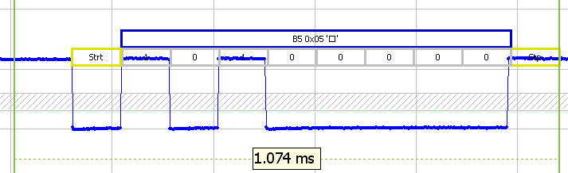
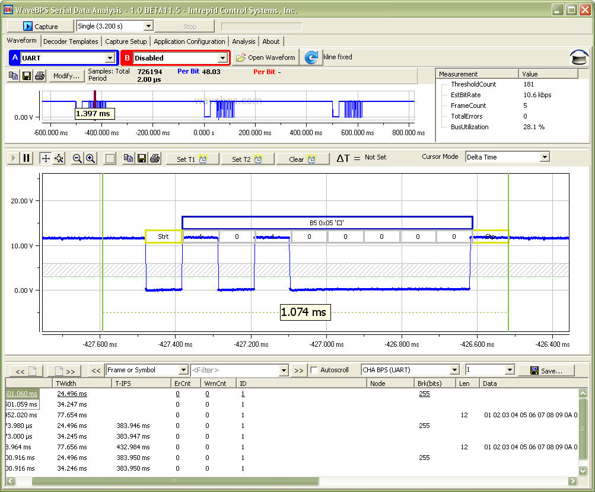

# UART: K-Line, J1708, ISO9141, GM CGI, RS232

The UART is a very common serial protocol. This type of serial communications is used for the popular RS232 protocol. Also, because of its wide availablity and low cost it is used in many automotive protocols such as J1708, ISO9141, K-Line, GM CGI, and RS232. More at [Wikipedia](https://en.wikipedia.org/wiki/Universal_asynchronous_receiver-transmitter).

<figure>

<figcaption>The UART byte begins with a stop bit, data follows and ends with one or more stop bits</figcaption>
</figure>

**Full Image**

<figure>

<figcaption></figcaption>
</figure>

