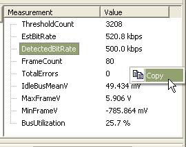

# Scalar Measurement List

The scalar list is a list of measurements that are made on the entire capture (figure 1). These maybe different for each decoder. You can copy the scalar list to the clipboard using its right click menu. You can also access these scalars remotely with the [Text API](/automated-test-with-wavebps).

<figure>

<figcaption>Figure 1 - The scalar measurement list includes measurements on the entire capture</figcaption>
</figure>

