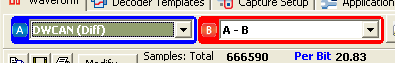
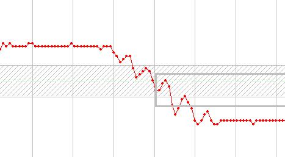
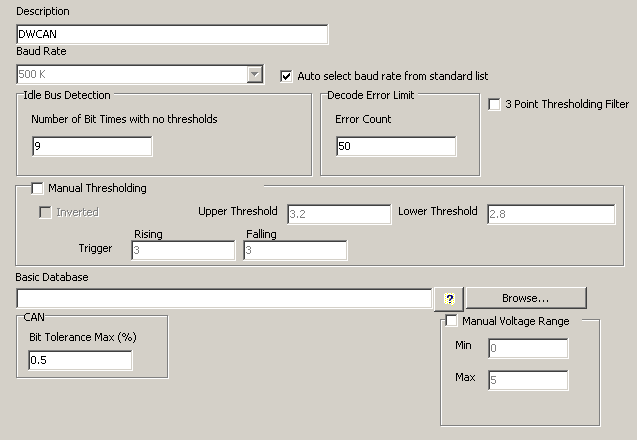

# Setting up Serial Decoding in WaveBPS

WaveBPS can apply a serial decoder to a waveform channel (figure 1). The decoder will analyze the waveform, extract the frame data, and add them to the event list box. Each channel can have one decoder.

<figure>

<figcaption>Figure 1 - You can select any decoder for each channel.</figcaption>
</figure>

import YouTubeEmbed from '@site/src/components/YouTubeEmbed';

<YouTubeEmbed videoId="Mr5J6A1b_BA" caption="Decoder Setup Video" />

Each decoder has settings which customize it to the waveform you are capturing. WaveBPS allows you to define as many decoders as you want. Each decoder can have different settings and a different custom description. For example, you could have many different dual wire CAN / CAN FD decoders such as CAN / CAN FD High, CAN / CAN FD Low, CAN / CAN FD Differential, and CAN / CAN FD Current Probe. The decoders are saved in the configuration file.

There are two math decoders which require no setup. This includes A-B and A+B. These reduce a two channel capture to one channel capture that is the math result of both channels. A-B is very useful for differential captures such as CAN / CAN FD where ground offsets may drift by several volts. For channels C and D there is support for C-D and C+D.

Every decoder allows you to enter a specific baud rate. Alternately, you can have WaveBPS try to automatically determine the bit rate by selecting "Auto select baud rate from standard list".

Idle bus detection is the number of bit times of idle bus the decoder will wait before beginning decoding. For some protocols such as UART and SPI it uses this time to determine when messages groupings stop.

Decode error limit is the number of errors a decoder will allow before it quits decoding. If the error limit is reached WaveBPS will show a warning.

For noisy signals the decoder can apply a 3 point moving average filter. To enable this feature click "3 Point Thresholding Filter". This filter only applies to decoding and will not apply to any automatic measurements that use voltage as part of the calculation.

The decoder converts the analog waveform into a one or zero by thresholding - comparing the analog signal to a level. WaveBPS uses hysteresis to do this. This is required for slowly changing or noisy waveforms which could trigger multiple times as it crosses a threshold (Figure 2). With hysteresis the analog signal must exit a specific voltage band before the trigger is allowed to occur again.

<figure>

<figcaption>Figure 2 - Here is a noisy CAN / CAN FD L waveform decoded perfectly with hysteresis.</figcaption>
</figure>

WaveBPS can attempt to automatically threshold the waveform based on the min and max voltage. Sometimes, this is not adequate and you can specify the entire waveform. You can also invert the thresholding which is required for looking for the opposite transitions which would be present on the negative lines of differential waveforms.

[WaveBPS supports a database](/advanced-analysis) which identifies events with a text description and source node. This text description is shown in the event list and the zoomed in view. This database is a simple text file that you can create with Notepad. [Vehicle Spy software](https://intrepidcs.com/products/software/vehicle-spy/) can also export this type of database after loading a DBC, VS3, UEF, LIN or FIBEX file.

Each decoder may have specific settings unique to that decoder. Table 1 below lists the settings and what there function is.

<figure>

<figcaption>Figure 3 - Each decoder can be customized to your application.</figcaption>
</figure>

**Table 1 - Additional Decoder Settings**

| Setting                                  | Description                                                                                                                                                                                                                  | Applies to                           |
|------------------------------------------|------------------------------------------------------------------------------------------------------------------------------------------------------------------------------------------------------------------------------|--------------------------------------|
| CAN / CAN FD Bit Tolerance               | The bit rate tolerance limit of a CAN / CAN FD message. All decoded CAN / CAN FD frames are measured for there bit tolerance and compared to this limit. If outside the limit an error is added to the CAN / CAN FD message. | All CAN / CAN FD                     |
| SWCAN Enable GMLAN Auto switch Baud Rate | This enables the decoder to monitor for a GMLAN 3110 HS programming switch.                                                                                                                                                  | SWCAN                                | 
| SWCAN Auto switch Baud Rate High         | This is the new baud rate when the decoder decodes a valid GMLAN 3110 HS programming switch.                                                                                                                                 | SWCAN                                |   
| SWCAN High Voltage Threshold             | This is the voltage threshold used to determine if the message was sent in high voltage mode                                                                                                                                 | SWCAN                                |   
| FlexRay Channel                          | This indicates what channel of FlexRay (A or B) was decoded. This is required for CRC calculation. Auto will calculate both and only error if it doesn't match one.                                                          | FlexRay                              |   
| ID (bits)                                | This indicates how much of the first part of the data section is used for message identification. This part will be used in database look up.                                                                                | I2C, UART, SPI, J1850 (8 or 24 only) |   
| Bit Organization Order                   | This indicates the order of bits in the serial stream (most significant or least significant order)                                                                                                                          | UART, SPI                            |   
| Bit Organization Byte Length (bits)      | This indicates how many bits each unit is that is sent on the bus.                                                                                                                                                           | UART, SPI                            |   
| UART parity                              | This indicates standard UART parity (more on [wikipedia](https://en.wikipedia.org/wiki/Universal_asynchronous_receiver-transmitter))                                                                                         | UART                                 |   
| UART stop bits                           | This indicates how many stop bits are used by the communications (more on [wikipedia](https://en.wikipedia.org/wiki/Universal_asynchronous_receiver-transmitter))                                                            | UART                                 |   
| SPI Mode                                 | This indicates the relationship between the clock and data signals in SPI and indicates when the clock samples the data (more on [wikipedia](https://en.wikipedia.org/wiki/Serial_Peripheral_Interface))                     | SPI                                  |
| Additional Channels                      | The I2C and SPI decoders require you to select the channel for the Clock line                                                                                                                                                | SPI, I2C                             |   

