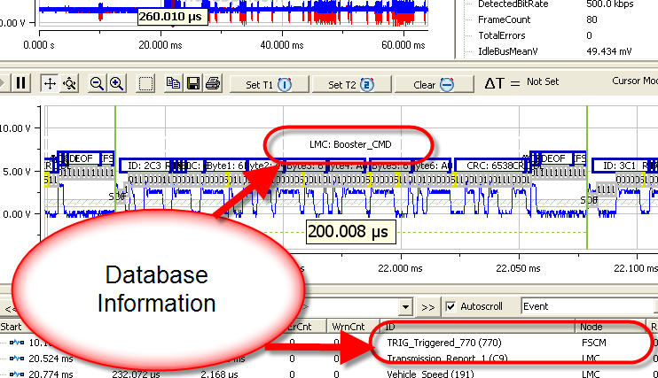
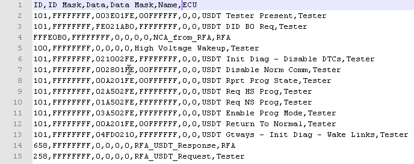
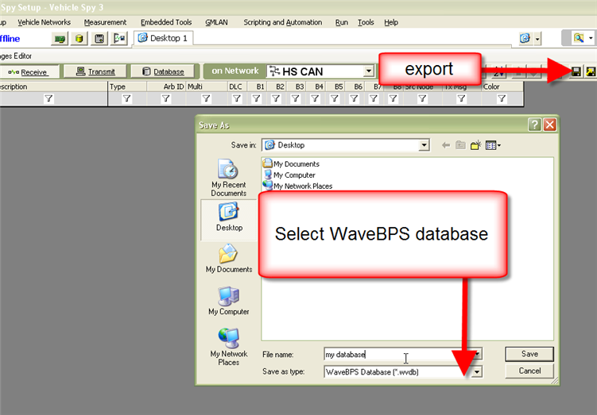

# WaveBPS Basic Databases

WaveBPS supports a simple database that matches up a message with a text description and a source node (Figure 1). [When enabled, the decoder](/setting-up-serial-decoding-in-wavebps) will search for each event in the database and if it finds a match it will display the text description and the node description in the event list. Next, it will display this description on the zoom plot above the event. The database also enables [node analysis](/advanced-analysis).

The database is a text file where each line describes one event in the file. It includes the ID, ID Mask, Data, Data Mask, Name and source node (Figure 2). The ID is up to a 32 bit ID andthe ID mask is a 32 bit mask applied to the ID. Database matching is also supported on the data section up to 32 bits with the data and data mask properties. Finally the name and source node are the text descriptions used to identify the event name and node name.

Vehicle Spy software (rev412 and above) support exporting WaveBPS databases (Figure 3).

An example database is included at this link swcan.wvdb (open below file as a text file). Notice the extension of this database is "wvdb."

import DownloadFile from '@site/src/components/DownloadFile';

<DownloadFile fileName="swcan.wvdb" fileSize="873B" filePath="downloads/swcan.wvdb" />

<figure>

<figcaption>Figure 1 - Database information is shown above the message and in the event list.</figcaption>
</figure>

<figure>

<figcaption>Figure 2 - The simple database is a text file which describes the events and nodes in a network.</figcaption>
</figure>

<figure>

<figcaption>Figure 3 - Vehicle Spy can export WaveBPS databases.</figcaption>
</figure>

